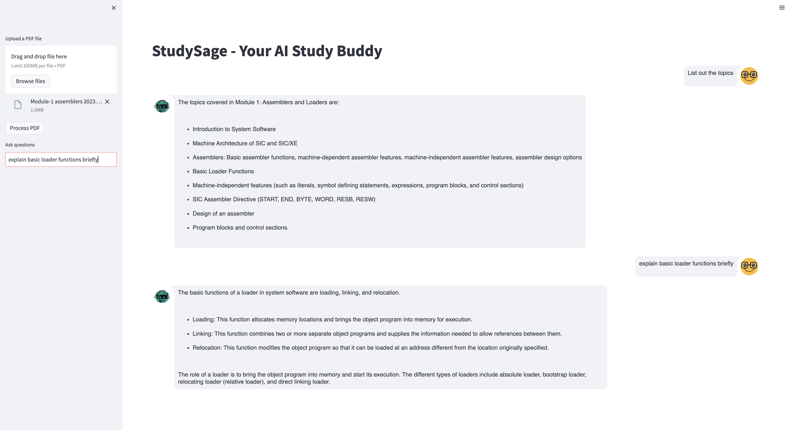

# 📚 StudySage - AI Study Assistant Chatbot

## Overview
StudySage is a web application that leverages the OpenAI API and the Langchain framework to provide an AI study assistant chatbot. The chatbot allows users to upload their study notes and engage in interactive conversations with the AI assistant, receiving personalized responses based on the information contained in the uploaded documents. The application utilizes Streamlit for the frontend interface and ChromaDB for efficient document retrieval.

## Architecture
The architecture of StudySage can be divided into the following components:

1. **OpenAI API:** StudySage integrates with the OpenAI API, which powers the natural language processing capabilities of the chatbot. It utilizes advanced language models, such as GPT-3.5, to generate intelligent and contextually relevant responses.

2. **Langchain Framework:** The Langchain framework acts as a bridge between the OpenAI API and the application. It provides a simplified interface for making requests to the OpenAI API and handling the responses. Langchain facilitates seamless integration and streamlines the development process.

3. **Streamlit Frontend:** StudySage uses Streamlit, a Python library for building interactive web applications, as the frontend interface. Streamlit enables users to easily interact with the chatbot, upload study notes, and receive responses in real-time.

4. **ChromaDB Vector Store:** To optimize document retrieval, StudySage employs ChromaDB as a document store. ChromaDB allows efficient storage and retrieval of document embeddings, enabling fast and accurate retrieval of relevant information during chatbot conversations.

## Steps to Implement
To set up and run StudySage locally, follow these steps:

1. Create a virtual environment: `virtualenv venv`

2. Activate the virtual environment: `source venv/bin/activate`

3. Install the required dependencies: `pip install -r requirements.txt`

4. Set up your OpenAI API key: Create a `.env` file in the project directory and add the following line:
   ```
   OPEN_AI_API = "YOUR_API_KEY"
   ```

5. Run the application: `streamlit run app.py`

## Example Image


The above image showcases the StudySage web application, where users can upload their study notes and engage in a chatbot conversation to receive personalized responses based on the content of the uploaded documents.

Feel free to reach out if you have any questions or need further assistance!